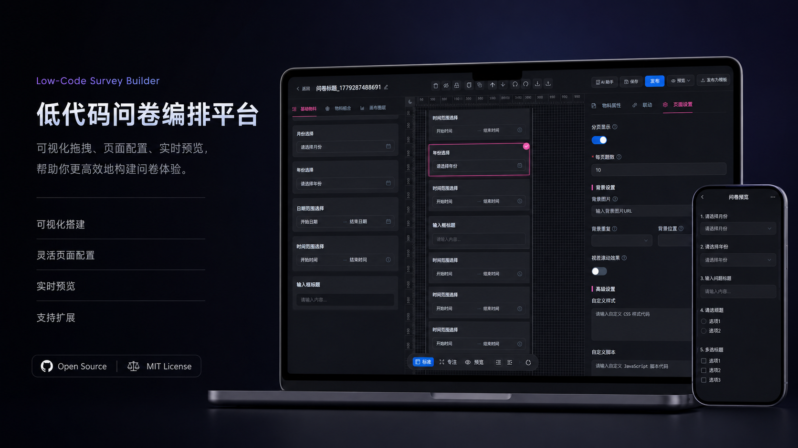

# QuizzyFlow

**低代码问卷编排平台** — 拖拽编排问卷，实时回收数据。

<p align="center">
  
</p>

---

## 产品简介

QuizzyFlow 是一款面向团队与个人的**可视化问卷搭建工具**。无需编写页面代码，通过拖拽组件、配置属性与页面样式，即可快速完成从设计、预览到发布回收的全流程。编辑器所见即所得，填写端自动适配移动端，让问卷制作与投放都更简单。

---

## 核心能力

| 能力 | 说明 |
| --- | --- |
| **可视化搭建** | 左侧物料库选组件，画布拖拽排序，标尺与网格辅助对齐 |
| **灵活页面配置** | 分页、背景图、视差滚动等页面级设置，打造品牌化问卷 |
| **实时预览** | 编辑时快速预览；支持完整预览与手机端效果查看 |
| **支持扩展** | 页面级自定义 CSS / JavaScript，满足进阶样式与交互需求 |

---

## 编辑器

面向创建者的**三栏编排工作台**，与产品预览图一致：

- **物料库**：60+ 种基础与组合组件（输入、选择、日期时间、展示、布局、反馈等），覆盖常见调研与表单场景
- **画布**：选中高亮、撤销重做、复制删除、图层管理；支持标准 / 聚焦 / 预览等视图模式
- **配置面板**
  - **物料属性**：逐项调整标题、选项、校验、样式等
  - **联动**：按填写内容控制题目显示、隐藏、必填等逻辑
  - **页面设置**：问卷信息、分页、背景与动效、自定义样式与脚本
- **AI 助手**：在编辑过程中辅助生成与调整问卷内容
- **协作流程**：保存、发布、发布为模板；支持从模板市场快速起步

---

## 填写与发布

- **一键发布**：生成可分享的填写链接，受访者打开即可作答
- **多端体验**：手机、平板、桌面自适应，选项与输入控件在移动端清晰易用
- **分页作答**：长问卷可按页拆分，降低填写压力
- **提交反馈**：可配置提交成功页、结果提示等结束态展示

---

## 数据与管理

- **答卷统计**：图表与汇总视图，实时掌握回收进度与选项分布
- **问卷中心**：列表管理、星标收藏、回收站恢复，方便日常维护
- **模板市场**：浏览、使用他人发布的模板，也可将自己的问卷发布为模板
- **个人中心**：账号信息、安全设置与个人数据概览

适用于**市场调研、满意度调查、活动报名、意见反馈、课程登记**等多种信息收集场景。

---

## 快速体验

```bash
# 安装依赖
npm install

# 启动本地服务后，在浏览器打开应用
npm run dev
```

注册账号后即可创建问卷，进入编辑器体验完整搭建流程。

---

<p align="center">
  <strong>Survey · Compose · Analyze</strong><br />
  拖拽编排问卷，实时回收数据。
</p>
